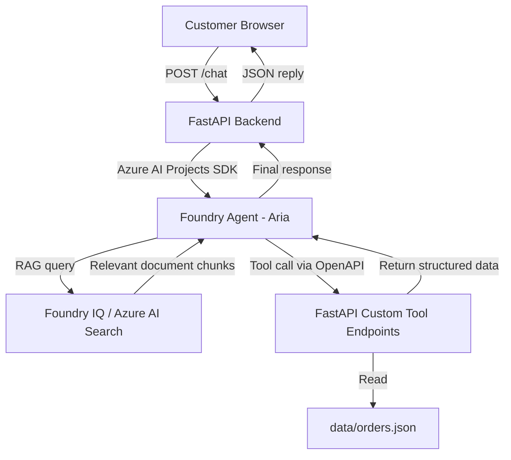

# Customer Support Agent

An AI-powered customer support agent for a fictional e-commerce company called **NovaBuy**. The agent — named **Aria** — answers customer questions using a curated knowledge base (RAG) and calls live data tools to look up orders, customers, refunds, and support tickets.

Built on **Microsoft Foundry**, **Foundry IQ / Azure AI Search**, **FastAPI**, and a vanilla HTML/CSS/JavaScript frontend as an academic project demonstrating a production-style AI agent architecture.

---

## Table of Contents

1. [Project Overview](#1-project-overview)
2. [Objectives](#2-objectives)
3. [Key Features](#3-key-features)
4. [Architecture](#4-architecture)
5. [Technology Stack](#5-technology-stack)
6. [Knowledge Base / RAG](#6-knowledge-base--rag)
7. [Custom Tools](#7-custom-tools)
8. [API Authentication](#8-api-authentication)
9. [Project Structure](#9-project-structure)
10. [Setup and Installation](#10-setup-and-installation)
11. [Running the Application](#11-running-the-application)
12. [API Endpoints](#12-api-endpoints)
13. [Example Agent Queries](#13-example-agent-queries)
14. [Testing](#14-testing)
15. [Security Considerations](#15-security-considerations)
16. [Troubleshooting](#16-troubleshooting)
17. [Project Status](#17-project-status)
18. [Future Improvements](#18-future-improvements)
19. [Author / Academic Project](#19-author--academic-project)

---

## 1. Project Overview

Customer support teams handle large volumes of repetitive queries — order status, return policies, refund eligibility, shipping information. This project demonstrates how a modern AI agent can handle those queries automatically while knowing when to escalate.

**Aria** is an AI customer support assistant powered by Microsoft Foundry. When a customer sends a message:

- If the question is about policy, FAQs, shipping, returns, or warranties, Aria retrieves the relevant answer from a structured knowledge base using Retrieval-Augmented Generation (RAG).
- If the question requires live data (a specific order, customer profile, refund status), Aria calls the appropriate custom tool and returns the result.
- If the issue cannot be resolved automatically, Aria creates a support ticket and confirms it with the customer.
- Throughout the conversation, Aria maintains context across multiple turns using Foundry's thread management.

The frontend is a simple single-page chat interface. The backend is a FastAPI application that bridges the frontend and the Foundry agent.

---

## 2. Objectives

- Build a working AI customer support agent using Microsoft Foundry Agent Service.
- Implement Retrieval-Augmented Generation (RAG) using Foundry IQ and Azure AI Search for policy and FAQ questions.
- Implement four custom tool functions that the agent can call to retrieve live data.
- Expose those tools as a secured FastAPI REST API consumed by the Foundry agent via an OpenAPI specification.
- Build a functional single-page chat UI connected to the FastAPI backend.
- Demonstrate a clear separation between RAG (static knowledge) and custom tools (dynamic data).
- Follow secure coding practices: no secrets in code or version control.

---

## 3. Key Features

- **AI customer support agent** powered by Microsoft Foundry (agent named *Aria*)
- **RAG-based policy and FAQ answering** via Foundry IQ and Azure AI Search
- **Order status lookup** — real-time order data retrieved via custom tool
- **Customer information lookup** — customer profile and order history via custom tool
- **Refund status lookup** — refund state and description via custom tool
- **Support ticket creation** — agent creates tickets on behalf of customers
- **Multi-turn conversation** — conversation context maintained across turns via `previous_response_id` (each response returns a `resp_...` ID passed back on the next request)
- **API-key protected custom tool endpoints** — four endpoints secured with `x-api-key` header authentication
- **Stub mode** — backend runs and responds meaningfully even before Foundry credentials are configured
- **Single-page chat UI** — HTML/CSS/JavaScript frontend with typing indicator, suggested questions, and error handling

---

## 4. Architecture

### Overview

```
Customer (Browser)
      │
      │  HTTP  (fetch API)
      ▼
┌─────────────────────────────────────────┐
│           Frontend (Static)             │
│   frontend/index.html + script.js       │
│   Sends POST /chat  { message, thread_id}│
└────────────────┬────────────────────────┘
                 │  HTTP POST /chat
                 ▼
┌─────────────────────────────────────────┐
│         FastAPI Backend                 │
│         backend/app.py                  │
│                                         │
│  • /health  — liveness check            │
│  • /chat    — forwards to Foundry agent │
│  • /orders  /customers /refunds         │
│    /tickets — custom tool endpoints     │
└────────────────┬────────────────────────┘
                 │  Azure AI Projects SDK
                 ▼
┌─────────────────────────────────────────┐
│     Microsoft Foundry Agent Service     │
│     CustomerSupportAgent (Aria)         │
│                                         │
│  Reads system prompt from               │
│  agent/system_prompt.md                 │
│                                         │
│  Decision logic:                        │
│  ┌─────────────────┐ ┌───────────────┐  │
│  │  Foundry IQ     │ │ OpenAPI Tools │  │
│  │  (RAG)          │ │ (Custom Tools)│  │
│  └────────┬────────┘ └──────┬────────┘  │
└───────────┼─────────────────┼───────────┘
            │                 │
            ▼                 ▼
  Azure AI Search      FastAPI Backend
  (knowledge index)    /orders /customers
                       /refunds /tickets
                            │
                            ▼
                     data/orders.json
                     (sample data)
```

### Key Concepts

| Concept | What it does in this project |
|---|---|
| **RAG (Retrieval-Augmented Generation)** | When Aria receives a policy question, Foundry IQ converts the query to a vector embedding, searches Azure AI Search for the most relevant knowledge document chunks, and returns them to the agent. The agent grounds its answer in those retrieved passages — it does not hallucinate from training memory. |
| **Custom Tools** | Four Python functions registered with the Foundry agent via an OpenAPI specification. When Aria needs live data (e.g. a specific order), it calls the corresponding FastAPI endpoint. The tool result is returned to the agent, which summarises it in natural language. |
| **Agent Orchestration** | The Foundry agent decides — per turn — whether to answer directly, retrieve from the knowledge base, call a tool, or do a combination. This decision is driven by the system prompt and the agent's understanding of the user's intent. |

### Mermaid Diagram



---

## 5. Technology Stack

| Layer | Technology | Purpose |
|---|---|---|
| AI Agent Platform | Microsoft Foundry Agent Service | Hosts and runs the CustomerSupportAgent (Aria) |
| RAG / Knowledge Retrieval | Foundry IQ + Azure AI Search | Indexes knowledge documents; retrieves relevant passages for grounding |
| Agent Model | Azure OpenAI (configured via `AGENT_MODEL`, default `gpt-4o`) | Language model powering the agent's responses |
| Azure Authentication | `DefaultAzureCredential` (azure-identity) | Authenticates backend to Azure with no hardcoded secrets |
| Backend Framework | Python 3.11+ / FastAPI | REST API serving the chat endpoint and custom tool endpoints |
| ASGI Server | Uvicorn | Runs the FastAPI application locally |
| Backend Config | python-dotenv | Loads `.env` into the process environment |
| Custom Tool Data | JSON file (`data/orders.json`) | Sample order data read by the four tool functions |
| Frontend | HTML5 / Vanilla CSS / Vanilla JavaScript | Single-page chat interface |
| OpenAPI | FastAPI auto-generated `/openapi.json` | Foundry reads this spec to know how to call the custom tool endpoints |
| Version Control | Git / GitHub | Source control and project history |
| Testing | pytest, pytest-asyncio, httpx | Test framework (no automated tests written yet — see Section 14) |

---

## 6. Knowledge Base / RAG

The agent's knowledge base consists of five Markdown documents stored in the `knowledge/` directory. These documents are the single source of truth for all policy and FAQ questions.

### Knowledge Documents

| # | File | Contents |
|---|---|---|
| 1 | `knowledge/faq.md` | Frequently asked customer questions and answers |
| 2 | `knowledge/shipping_policy.md` | Shipping methods, delivery estimates, and options |
| 3 | `knowledge/return_policy.md` | Return eligibility rules, timelines, and procedures |
| 4 | `knowledge/refund_policy.md` | Refund eligibility, processing times, and methods |
| 5 | `knowledge/warranty_policy.md` | Warranty coverage, claims process, and exclusions |

### How RAG Works in This Project

1. **Ingestion** — The knowledge Markdown files are uploaded to Foundry IQ, which indexes them in Azure AI Search. Azure AI Search creates vector embeddings of document chunks.
2. **Retrieval** — When the agent receives a policy or FAQ question, Foundry IQ converts the query into a vector embedding and searches the index for the most semantically similar document chunks.
3. **Grounding** — The top-ranked passages are injected into the agent's context. The agent uses only those retrieved passages to construct its answer.
4. **Response** — The agent produces a grounded answer citing the retrieved content. It does not rely on its training-time memory for NovaBuy-specific policies — the answer comes from the indexed documents.

> **Important:** The model does not have permanent or built-in knowledge of NovaBuy's policies. If a document is removed from the index, the agent will not be able to answer questions about it.

---

## 7. Custom Tools

Four custom tool functions are implemented in `backend/tools/`. Each function is exposed as a FastAPI endpoint. Foundry reads the OpenAPI specification at `/openapi.json` and calls these endpoints when the agent decides it needs live data.

### Tool Summary

| Tool Function | Purpose | API Endpoint | Method |
|---|---|---|---|
| `check_order_status` | Look up the current status, delivery date, and refund state of an order by order ID | `GET /orders/{order_id}` | GET |
| `get_customer_info` | Retrieve a customer's profile and full order history by customer ID | `GET /customers/{customer_id}` | GET |
| `check_refund_status` | Check the refund status of a specific order and return a human-readable description | `GET /refunds/{order_id}` | GET |
| `create_support_ticket` | Create a support ticket for a customer with a description of their issue | `POST /tickets` | POST |

### Data Source

All four tools read from `data/orders.json`, which contains sample order records. Customer data is derived from order records — there is no separate customer database. Support tickets are generated in-memory and are not persisted (mock implementation).

---

## 8. API Authentication

### How It Works

The four custom tool endpoints (`/orders`, `/customers`, `/refunds`, `/tickets`) are protected by API-key authentication. Every request to these endpoints must include the following HTTP header:

```
x-api-key: <your-api-key>
```

FastAPI validates the header against the value of the `CUSTOMER_SUPPORT_API_KEY` environment variable using a `Security` dependency. If the header is missing or incorrect, the server returns `HTTP 401 Unauthorized`.

The `/health` and `/chat` endpoints do **not** require an API key.

### OpenAPI Security Scheme

FastAPI automatically includes the API key scheme in the generated OpenAPI specification (`/openapi.json`):

```json
"components": {
  "securitySchemes": {
    "APIKeyHeader": {
      "type": "apiKey",
      "in": "header",
      "name": "x-api-key"
    }
  }
}
```

Microsoft Foundry reads this specification when importing the CustomerSupportAPI as an OpenAPI Tool, and passes the API key automatically on each tool call.

### Environment Files

| File | Purpose |
|---|---|
| `.env` | Your local secret values — **never committed to Git** |
| `.env.example` | Placeholder template — committed to Git, contains no real secrets |

The `.env.example` entry for the API key:

```ini
CUSTOMER_SUPPORT_API_KEY=replace-with-your-local-api-key
```

> **Never put a real API key, password, or secret into `.env.example`, README, or any committed file.**

### Foundry Connection

When adding the CustomerSupportAPI as an OpenAPI Tool in the Foundry portal, you provide:
- The public URL of the FastAPI backend (e.g. your ngrok URL during local development)
- The `x-api-key` value — stored in Foundry's tool configuration, never in code

---

## 9. Project Structure

```
customer-support-agent/
│
├── agent/                        # Foundry agent configuration
│   ├── agent_config.py           # Foundry client initialisation
│   └── system_prompt.md          # Aria's system prompt (persona, rules, tone)
│
├── backend/                      # FastAPI backend
│   ├── app.py                    # Application entry point and all route definitions
│   ├── agent.py                  # Foundry agent interface layer (stub + live mode)
│   ├── config.py                 # Centralised settings from environment variables
│   └── tools/                    # Custom tool implementations
│       ├── order_status.py       # check_order_status — GET /orders/{order_id}
│       ├── customer_info.py      # get_customer_info  — GET /customers/{customer_id}
│       ├── refund_status.py      # check_refund_status — GET /refunds/{order_id}
│       └── support_ticket.py     # create_support_ticket — POST /tickets
│
├── data/
│   └── orders.json               # Sample order data used by all four tools
│
├── docs/                         # Reserved for architecture docs and diagrams
│
├── frontend/                     # Single-page chat interface
│   ├── index.html                # Chat UI markup
│   ├── style.css                 # Styling
│   └── script.js                 # Chat logic, API calls, thread management
│
├── knowledge/                    # RAG knowledge base documents
│   ├── faq.md
│   ├── shipping_policy.md
│   ├── return_policy.md
│   ├── refund_policy.md
│   └── warranty_policy.md
│
├── tests/                        # Test directory (framework configured, no tests yet)
│
├── .env                          # Local secrets — NOT committed (in .gitignore)
├── .env.example                  # Placeholder template — committed, no real secrets
├── .gitignore                    # Excludes .env, __pycache__, etc.
├── PROJECT_CONTEXT.md            # Project goals, architecture, and rules
├── TASKS.md                      # Phase-by-phase task checklist
├── README.md                     # This file
└── requirements.txt              # Python dependencies
```

---

## 10. Setup and Installation

### Prerequisites

- Python 3.11 or later
- An active Microsoft Foundry project with a deployed agent (`CustomerSupportAgent`)
- Azure AI Search index populated with the knowledge documents via Foundry IQ
- Azure CLI installed and logged in (`az login`) for local `DefaultAzureCredential` authentication

### Steps

**1. Clone the repository**

```bash
git clone https://github.com/<your-username>/customer-support-agent.git
cd customer-support-agent
```

**2. Create and activate a virtual environment**

```bash
python -m venv .venv

# Windows (PowerShell)
.venv\Scripts\Activate.ps1

# macOS / Linux
source .venv/bin/activate
```

**3. Install dependencies**

```bash
pip install -r requirements.txt
```

**4. Create your local `.env` file**

```bash
copy .env.example .env      # Windows
# or
cp .env.example .env        # macOS / Linux
```

**5. Fill in the required values in `.env`**

Open `.env` and replace the placeholders with your actual values:

```ini
# Microsoft Foundry
AZURE_FOUNDRY_ENDPOINT=https://your-endpoint.api.azureml.ms
AZURE_FOUNDRY_PROJECT_NAME=your-project-name
AGENT_NAME=CustomerSupportAgent
AGENT_MODEL=gpt-4o

# Azure AI Search (used by Foundry IQ — credentials managed by DefaultAzureCredential)
SEARCH_INDEX_NAME=your-search-index
SEARCH_ENDPOINT=https://your-search.search.windows.net
# No SEARCH_API_KEY needed: Foundry IQ authenticates via DefaultAzureCredential.

# FastAPI
BACKEND_HOST=0.0.0.0
BACKEND_PORT=8000
DEBUG=true

# Custom tool API authentication
CUSTOMER_SUPPORT_API_KEY=your-strong-random-key
```

> Do **not** commit `.env`. It is already excluded by `.gitignore`.

**6. Authenticate with Azure**

```bash
az login
```

`DefaultAzureCredential` will use your Azure CLI session for local development.

---

## 11. Running the Application

### Start the FastAPI backend

```bash
uvicorn backend.app:app --reload --host 0.0.0.0 --port 8000
```

The API will be available at:

| URL | Purpose |
|---|---|
| `http://localhost:8000/health` | Liveness check |
| `http://localhost:8000/docs` | Interactive Swagger UI |
| `http://localhost:8000/openapi.json` | OpenAPI specification (used by Foundry) |

### Open the frontend

The frontend is a set of static files — no separate build step or server is needed.

Open `frontend/index.html` directly in your browser, **or** serve it with any static file server:

```bash
# Using Python's built-in server (from the frontend/ directory)
python -m http.server 3000 --directory frontend
```

Then open `http://localhost:3000` in your browser.

> The frontend sends requests to `http://localhost:8000` by default. If you change the backend port, update the `BACKEND_URL` constant in `frontend/script.js`.

### Expose the backend publicly (for Foundry tool integration)

During local development, ngrok can expose your local FastAPI server so that Microsoft Foundry can reach the custom tool endpoints:

```bash
ngrok http 8000
```

Use the ngrok HTTPS URL as the server URL when registering the OpenAPI Tool in the Foundry portal.

> ngrok is a local development convenience. It is not a production deployment method.

---

## 12. API Endpoints

### System Endpoints (no authentication required)

#### `GET /health`

Liveness check. Returns `200 OK` when the server is running.

```bash
curl http://localhost:8000/health
```

```json
{
  "status": "ok",
  "foundry_configured": true
}
```

#### `POST /chat`

Send a message to the CustomerSupportAgent and receive a reply.

```bash
curl -X POST http://localhost:8000/chat \
  -H "Content-Type: application/json" \
  -d '{"message": "What is your return policy?", "thread_id": null}'
```

```json
{
  "reply": "You can return most items within 30 days of delivery...",
  "thread_id": "resp_abc123",
  "stub": false
}
```

Pass the returned `thread_id` back on subsequent requests to maintain conversation context.

---

### Custom Tool Endpoints (x-api-key required)

All four endpoints below require the `x-api-key` header. Replace `<your-api-key>` with the value of `CUSTOMER_SUPPORT_API_KEY` from your `.env`.

#### `GET /orders/{order_id}`

Look up an order by order ID.

```bash
curl http://localhost:8000/orders/NB-1095768 \
  -H "x-api-key: <your-api-key>"
```

```json
{
  "found": true,
  "order_id": "NB-1095768",
  "customer_name": "...",
  "product": "...",
  "status": "Delayed",
  "order_date": "...",
  "expected_delivery": "...",
  "refund_status": "None"
}
```

#### `GET /customers/{customer_id}`

Retrieve a customer profile and order history.

```bash
curl http://localhost:8000/customers/CUST-00391 \
  -H "x-api-key: <your-api-key>"
```

```json
{
  "found": true,
  "customer_id": "CUST-00391",
  "customer_name": "...",
  "total_orders": 1,
  "orders": [...]
}
```

#### `GET /refunds/{order_id}`

Check the refund status of an order.

```bash
curl http://localhost:8000/refunds/NB-1063017 \
  -H "x-api-key: <your-api-key>"
```

```json
{
  "found": true,
  "order_id": "NB-1063017",
  "refund_status": "Refund Requested",
  "refund_description": "A refund has been requested and is currently under review..."
}
```

#### `POST /tickets`

Create a support ticket.

```bash
curl -X POST http://localhost:8000/tickets \
  -H "Content-Type: application/json" \
  -H "x-api-key: <your-api-key>" \
  -d '{"customer_id": "CUST-00391", "issue": "My order arrived damaged."}'
```

```json
{
  "success": true,
  "ticket_id": "TKT-A3F9K2",
  "customer_id": "CUST-00391",
  "status": "Open",
  "expected_response_by": "2026-09-22T06:00:00Z",
  "message": "Your support ticket has been created successfully..."
}
```

Returns `HTTP 401 Unauthorized` if the `x-api-key` header is missing or incorrect.

You can also explore and test all endpoints interactively at `http://localhost:8000/docs`.

---

## 13. Example Agent Queries

The following examples show realistic queries you can send through the chat interface or the `/chat` endpoint. The method column indicates how the agent resolves the query.

| Example Query | Resolution Method |
|---|---|
| "What is your return policy?" | **RAG** — retrieved from `knowledge/return_policy.md` |
| "What are your shipping options?" | **RAG** — retrieved from `knowledge/shipping_policy.md` |
| "Does my product have a warranty?" | **RAG** — retrieved from `knowledge/warranty_policy.md` |
| "How do I get a refund?" | **RAG** — retrieved from `knowledge/refund_policy.md` |
| "Where is my order NB-1095768?" | **Custom Tool** — calls `GET /orders/NB-1095768` |
| "Show me the customer information for CUST-00391." | **Custom Tool** — calls `GET /customers/CUST-00391` |
| "What is the refund status for order NB-1063017?" | **Custom Tool** — calls `GET /refunds/NB-1063017` |
| "My order arrived damaged. Create a support ticket for customer CUST-00391." | **Custom Tool** — calls `POST /tickets` |
| "My order NB-1095768 is delayed. What is your policy and can you raise a ticket?" | **RAG + Custom Tool** — retrieves shipping policy AND creates a ticket |

---

## 14. Testing

### Automated Tests

16 automated tests are implemented in `tests/` covering all four custom tool functions:

```bash
pytest tests/ -v
```

All 16 tests pass. They test each tool for valid input, invalid/unknown IDs, and edge cases (empty input, short strings).

### Manual and API Testing

All core agent functionality has been tested manually during development using:

- **Swagger UI** at `http://localhost:8000/docs` — for testing the four custom tool endpoints with the `x-api-key` header
- **curl** — for command-line endpoint verification
- **Microsoft Foundry Playground** — for end-to-end agent conversation testing (RAG, custom tools, combined scenarios)
- **Chat frontend** — for UI and multi-turn conversation testing

### Scenarios Verified

- Order status lookup (valid order ID, invalid order ID)
- Customer information lookup (valid customer ID, not found)
- Refund status lookup (various refund states)
- Support ticket creation (valid input, invalid input)
- Policy and FAQ questions answered via RAG
- Combined RAG + custom tool queries
- Error handling (missing API key → 401, not found → 404)
- Stub mode (backend responds without Foundry credentials)

---

## 15. Security Considerations

- **Secrets must stay in `.env`** — never in Python source, HTML, JavaScript, or any committed file.
- **`.env` must not be committed** — it is excluded by `.gitignore` via both `.env` and `*.env` rules.
- **`.env.example` contains only placeholders** — it is safe to commit, but no real values should ever be added to it.
- **Custom tool endpoints use API-key authentication** — every call to `/orders`, `/customers`, `/refunds`, and `/tickets` must include a valid `x-api-key` header.
- **The API key must not appear in frontend code** — the frontend communicates only with `/chat` and `/health`, which do not require authentication. The API key is used only by the Foundry agent server-to-server.
- **Azure credentials use `DefaultAzureCredential`** — no Azure API keys or secrets are hardcoded. Local development uses `az login`; production uses Managed Identity.
- **The real API key must not appear in this README** — example commands use `<your-api-key>` as a placeholder.

---

## 16. Troubleshooting

### FastAPI fails to start

- Ensure you are in the project root directory, not inside `backend/`.
- Run `uvicorn backend.app:app --reload` from the project root.
- Check that your virtual environment is activated and dependencies are installed.

### Missing environment variable errors

- Verify that `.env` exists in the project root and contains all required variables.
- Copy from `.env.example` and fill in all placeholder values.
- Variables read by `backend/config.py` all have empty-string defaults — a missing value will not crash startup but may cause `HTTP 503` on the `/chat` endpoint if Foundry is not configured.

### `/chat` returns a stub response

- The backend is running in stub mode because `AZURE_FOUNDRY_ENDPOINT` or `AGENT_NAME` is not set in `.env`.
- Set both variables and restart the server.

### Foundry agent cannot reach the custom tool endpoints

- The FastAPI backend must be publicly reachable. Use ngrok during local development:
  ```bash
  ngrok http 8000
  ```
- In the Foundry portal, set the OpenAPI Tool server URL to your ngrok HTTPS URL (e.g. `https://abc123.ngrok.io`).
- Ensure the `x-api-key` value configured in Foundry matches `CUSTOMER_SUPPORT_API_KEY` in your `.env`.
- Verify the tool endpoints return `200 OK` via Swagger UI before registering them in Foundry.

### Custom tool endpoints return 401 Unauthorized

- The `x-api-key` header is missing or the value does not match `CUSTOMER_SUPPORT_API_KEY`.
- Double-check the value in `.env` and the value configured in Foundry.

### RAG retrieval returns irrelevant or empty results

- Confirm that the knowledge documents have been uploaded and indexed in Foundry IQ.
- Check that the Azure AI Search index name in `.env` matches the index created in the Foundry portal.
- Verify that the Foundry agent has the Foundry IQ knowledge source connected.

### ngrok tunnel disconnects

- ngrok free tier tunnels expire after a few hours. Restart ngrok and update the server URL in the Foundry tool configuration.

---

## 17. Project Status

The core agent functionality has been fully implemented and tested:

- ✅ FastAPI backend with all six endpoints
- ✅ Four custom tool functions with input validation and structured responses
- ✅ Sample order data (`data/orders.json`)
- ✅ Five knowledge base documents in `knowledge/`
- ✅ Foundry agent configuration and system prompt
- ✅ Single-page chat frontend
- ✅ API-key authentication on custom tool endpoints
- ✅ OpenAPI specification generated and verified
- ✅ Multi-turn conversation via `previous_response_id` (Foundry Responses API)
- ✅ Stub mode for development without Foundry credentials

This is an academic demonstration project. It is not deployed to a production environment and is not intended for production use in its current form.

---

## 18. Future Improvements

The following are identified areas for improvement. None of these are currently implemented.

| Improvement | Description |
|---|---|
| **Persistent ticket storage** | Support tickets are currently generated in-memory and not saved. A real implementation would persist tickets to a database. |
| **Real order database** | Order data is currently read from a static JSON file. A real implementation would connect to a live order management system. |
| **Production deployment** | The project has no production deployment. A production setup would use Azure App Service or Azure Container Apps, with HTTPS, Managed Identity, and proper secrets management. |
| **Automated test suite** | 16 unit tests cover the four custom tool functions. Future work would add integration tests for the API endpoints and end-to-end agent tests. |
| **Stronger authentication** | The API key scheme is suitable for development. Production deployments could use OAuth 2.0 or Azure Managed Identity for service-to-service authentication. |
| **Rate limiting** | No rate limiting is currently applied. Production APIs should limit request rates to prevent abuse. |
| **Frontend improvements** | The chat UI could be extended with message timestamps, conversation history persistence, and accessibility improvements. |
| **Monitoring and logging** | Structured logging and application monitoring (e.g. Azure Monitor) are not currently configured. |
| **Multi-language support** | The agent currently operates in English only. |

---

## 19. Author / Academic Project

This project was developed as a solo academic project to demonstrate the design and implementation of an AI-powered customer support agent using Microsoft Foundry and related Azure services.

All code, configuration, and documentation were written by a single developer. The NovaBuy brand, customer data, and order records are entirely fictional and were created for demonstration purposes only.

---

*For questions about the project structure or setup, refer to [PROJECT_CONTEXT.md](PROJECT_CONTEXT.md) for architectural context and [TASKS.md](TASKS.md) for the development phase breakdown.*