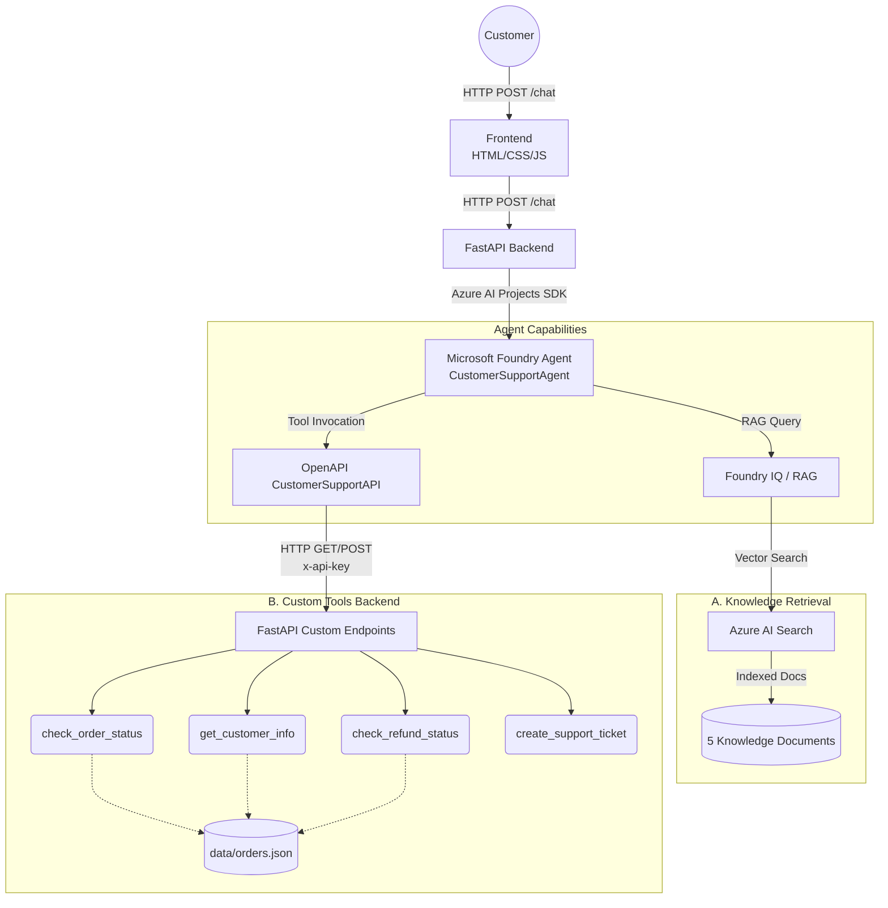
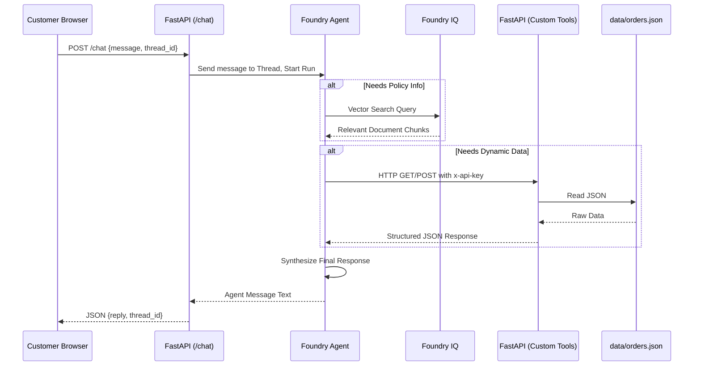

# Customer Support Agent — System Architecture

## 1. Architecture Overview

The Customer Support Agent system is an AI-powered, multi-turn conversational interface designed to assist customers of the fictional e-commerce company, NovaBuy. The system aims to automate routine customer service inquiries, such as checking order statuses, understanding return and refund policies, and escalating complex issues by creating support tickets.

At its core, the architecture relies on the **Microsoft Foundry Agent Service** to orchestrate the conversation. The agent is augmented with two primary capabilities:
1.  **Static Knowledge Retrieval (RAG):** Using Foundry IQ and Azure AI Search to answer policy and FAQ questions based on a curated set of markdown documents.
2.  **Dynamic Data Access (Custom Tools):** Using an OpenAPI-compliant REST backend (built with FastAPI) to query real-time mock data and perform actions on behalf of the customer.

The frontend is a lightweight, single-page application that communicates with a FastAPI backend, which in turn acts as the bridge to the Microsoft Foundry ecosystem.

---

## 2. High-Level Architecture

The following diagram illustrates the high-level architecture and interactions between the major components of the system.



---

## 3. Component Description

| Component | Description |
| :--- | :--- |
| **Frontend** | A vanilla HTML, CSS, and JavaScript single-page application (`frontend/index.html`). It handles user input, renders chat messages, displays typing indicators, and manages the `thread_id` for multi-turn conversations. |
| **FastAPI Backend** | A Python-based REST API server (`backend/app.py`). It serves as the gateway for the frontend chat requests and hosts the custom OpenAPI endpoints used by the agent. It manages API key authentication for protected endpoints. |
| **Microsoft Foundry Agent** | The core AI orchestrator ("Aria"). Powered by an Azure OpenAI model (e.g., GPT-4o), it interprets user intent, manages conversation state, decides when to search knowledge or invoke tools, and generates natural language responses. |
| **Foundry IQ** | The Retrieval-Augmented Generation (RAG) orchestrator within Microsoft Foundry. It handles the ingestion of documents and coordinates queries against the search index. |
| **Azure AI Search** | The vector database and search engine that stores embeddings of the knowledge documents and retrieves relevant chunks based on semantic similarity to user queries. |
| **Knowledge Documents** | Five Markdown files located in the `knowledge/` directory that serve as the ground truth for company policies and FAQs. |
| **OpenAPI Tool** | An abstraction within Microsoft Foundry that allows the agent to understand and interact with external REST APIs based on an OpenAPI JSON specification (provided by FastAPI). |
| **Custom Tools** | Four specific Python functions (`backend/tools/`) that execute business logic, such as looking up order statuses or creating support tickets, returning structured JSON data. |
| **Data Files** | A static JSON file (`data/orders.json`) that acts as a mock database for orders and customer history. |

---

## 4. Request and Response Flow

When a customer interacts with the agent, the system follows a defined request-response lifecycle:

1.  **Customer Input:** The customer types a message into the frontend chat interface and clicks send.
2.  **Frontend Transmission:** The JavaScript client sends an HTTP `POST` request to the backend's `/chat` endpoint, including the user's message and the current `thread_id` (if the conversation is ongoing).
3.  **Backend Reception:** FastAPI receives the request and passes the payload to the agent interface layer (`backend/agent.py`).
4.  **Agent Processing:** The backend uses the Azure AI Projects SDK to append the message to the active Foundry thread and initiates an agent run.
5.  **Agent Orchestration:** The Microsoft Foundry Agent evaluates the input against its system prompt. It determines if it can answer directly, if it needs to retrieve policy information, or if it must fetch dynamic data.
6.  **Knowledge Retrieval (If needed):** For policy or FAQ questions, the agent queries Foundry IQ, which searches Azure AI Search and returns relevant document chunks.
7.  **Tool Invocation (If needed):** For dynamic requests (e.g., "Where is my order?"), the agent pauses generation, determines the required parameters, and sends an OpenAPI tool call to the FastAPI custom endpoints (authenticating via `x-api-key`). The backend executes the python function and returns the JSON result to the agent.
8.  **Final Generation:** The agent synthesizes the retrieved knowledge and/or tool outputs into a concise, natural language response.
9.  **Response Delivery:** The backend polls for the completed run, extracts the agent's text response, and returns it to the frontend alongside the `thread_id`.
10. **UI Update:** The frontend renders the agent's message in the chat window.

---

## 5. RAG Architecture

### What is RAG?
Retrieval-Augmented Generation (RAG) is a technique that grounds a Large Language Model's (LLM) responses in specific, external data rather than relying solely on the information the model was originally trained on.

### Why is it used?
In this system, RAG ensures that Aria answers customer questions based *only* on NovaBuy's official, current policies. It prevents the model from hallucinating generic e-commerce policies or providing outdated information. The agent does not have inherent memory of NovaBuy; it relies entirely on retrieval.

### The Knowledge Base
The RAG system indexes five static markdown files located in `knowledge/`:
1.  `faq.md`
2.  `shipping_policy.md`
3.  `return_policy.md`
4.  `refund_policy.md`
5.  `warranty_policy.md`

### RAG Workflow
1.  **Ingestion:** Foundry IQ processes the markdown files, chunks the text, generates vector embeddings, and stores them in **Azure AI Search**.
2.  **Retrieval:** When a user asks about returning an item, Foundry IQ converts the question into an embedding and performs a vector search against Azure AI Search to find the most semantically similar chunks.
3.  **Grounding & Generation:** The retrieved text chunks are appended to the agent's prompt context. The agent is instructed to answer the user's question using *only* this provided context.

---

## 6. Custom Tool Architecture

While RAG handles static policies, dynamic, user-specific data is managed via Custom Tools. These tools are Python functions exposed as REST endpoints by FastAPI.

| Tool | Purpose | Endpoint | Method |
| :--- | :--- | :--- | :--- |
| `check_order_status` | Looks up status, delivery date, and basic details of an order. | `/orders/{order_id}` | GET |
| `get_customer_info` | Retrieves customer profile and aggregates their entire order history. | `/customers/{customer_id}` | GET |
| `check_refund_status` | Checks the specific refund state and description for an order. | `/refunds/{order_id}` | GET |
| `create_support_ticket` | Generates a mock support ticket with an SLA when issues require escalation. | `/tickets` | POST |

### OpenAPI Integration
FastAPI automatically generates an OpenAPI 3.0 specification (at `/openapi.json`). This specification describes the paths, required parameters, and authentication methods for these four endpoints. The Microsoft Foundry Agent is configured with this specification, enabling it to understand what tools are available, what data they require (e.g., `order_id`), and how to format the HTTP request to invoke them.

---

## 7. Agent Decision Flow

The agent's decision-making process is guided by its system prompt (`agent/system_prompt.md`). It dynamically routes requests based on intent:

*   **Policy / FAQ Queries (e.g., "How long do I have to return an item?"):**
    The agent recognizes a request for static rules and triggers the Foundry IQ / RAG pipeline to search the knowledge base.
*   **Dynamic Data Queries (e.g., "Has my refund been processed for order NB-1063017?"):**
    The agent recognizes the need for live data, extracts the entity (`NB-1063017`), and invokes the appropriate custom tool (e.g., `check_refund_status`).
*   **Action Requests (e.g., "I want to speak to a human about my broken item."):**
    The agent recognizes an escalation or action intent and invokes the `create_support_ticket` tool.
*   **Combined Requests (e.g., "My order NB-1095768 is delayed. Can I get a refund based on your policy?"):**
    The agent is capable of multi-step reasoning. It may first query the `check_order_status` tool to verify the delay, then query the RAG system for the delayed-order refund policy, and finally synthesize both into a cohesive answer.

---

## 8. API Security

To prevent unauthorized access to customer data, the custom tool endpoints are secured.

*   **`x-api-key` Header:** All requests to `/orders`, `/customers`, `/refunds`, and `/tickets` must include an `x-api-key` HTTP header.
*   **API Key Connection:** When configuring the OpenAPI tool in Microsoft Foundry, this API key is saved securely in the Azure portal. Foundry automatically attaches this header when the agent invokes a tool.
*   **`.env` Management:** Locally, the backend reads the expected key from the `CUSTOMER_SUPPORT_API_KEY` environment variable defined in the `.env` file.
*   **No Committed Secrets:** The `.env` file is explicitly ignored by git (`.gitignore`). A placeholder template, `.env.example`, is provided for setup but contains no real credentials.
*   **Frontend Security:** The frontend only communicates with the public `/chat` endpoint. It does not possess, nor does it need, the API key. This prevents exposing the secret to the client's browser.

---

## 9. Data Flow



---

## 10. Error Handling

The system implements robust error handling at multiple levels:

*   **Invalid Identifiers:** If the agent provides an invalid or non-existent `order_id` or `customer_id` to a custom tool, the tool returns a graceful JSON error response (e.g., `{"found": false, "error": "No order found..."}`). The agent reads this and informs the user politely.
*   **Invalid Ticket Input:** The `create_support_ticket` tool validates input length and presence. If the description is too short, it returns an error prompting the agent to ask the user for more details.
*   **API Authentication Errors:** If an endpoint is called without a valid `x-api-key`, FastAPI immediately returns an `HTTP 401 Unauthorized` response.
*   **Stub Mode (Missing Configuration):** If the backend is started without `AZURE_FOUNDRY_ENDPOINT` or `AGENT_ID` defined in the environment, the `/chat` endpoint operates in "stub mode." It intercepts requests and returns a static fallback message, preventing server crashes during UI development.
*   **Agent Timeouts:** If the Foundry agent takes longer than the configured timeout (60 seconds) to complete a run, the backend raises an `AgentError` and returns a generic `HTTP 500` error to the frontend, masking internal stack traces from the user.

---

## 11. Example Flows

### Example 1 — Policy Question
**User:** *"What is the return policy?"*
**Flow:** Agent detects a policy intent → Queries Foundry IQ → Azure AI Search returns chunks from `knowledge/return_policy.md` → Agent summarizes the 30-day return window for the user.

### Example 2 — Order Status
**User:** *"Where is my order NB-1095768?"*
**Flow:** Agent extracts ID "NB-1095768" → Invokes OpenAPI tool `check_order_status` → FastAPI reads `orders.json` → Returns status "Delayed" → Agent relays the status and expected delivery date to the user.

### Example 3 — Refund
**User:** *"What is the refund status for NB-1063017?"*
**Flow:** Agent extracts ID "NB-1063017" → Invokes OpenAPI tool `check_refund_status` → FastAPI returns "Refund Requested" → Agent informs the user that the refund is under review.

### Example 4 — Support Ticket
**User:** *"My order arrived damaged. Create a support ticket for customer CUST-00391."*
**Flow:** Agent extracts ID and issue description → Invokes OpenAPI tool `create_support_ticket` → FastAPI generates a mock ticket ID (e.g., `TKT-A3F9K2`) → Agent confirms ticket creation and provides the reference number and SLA to the user.

### Example 5 — Combined RAG + Tool
**User:** *"My order NB-1095768 is delayed. What does your refund policy say about delayed orders?"*
**Flow:** Agent invokes `check_order_status` to verify the delay. Concurrently or sequentially, it queries Foundry IQ for the refund policy regarding delays. The agent combines the live status ("Your order is indeed delayed...") with the retrieved policy ("...according to our policy, you are eligible for shipping fee refunds...") into a single, cohesive response.

---

## 12. Repository Structure

```text
customer-support-agent/
├── agent/                        # Foundry configuration
│   ├── agent_config.py           # Azure client initialization
│   └── system_prompt.md          # Core instructions defining the agent's behavior
├── backend/                      # FastAPI Application
│   ├── app.py                    # API routing, dependencies, and OpenAPI generation
│   ├── agent.py                  # Integration layer communicating with Azure SDK
│   ├── config.py                 # Environment variable management
│   └── tools/                    # Implementation of the 4 OpenAPI custom tools
├── data/                         # Mock data storage
│   └── orders.json               # JSON database for orders and customers
├── docs/                         # System documentation
│   └── architecture.md           # This architecture document
├── frontend/                     # Client-side application
│   ├── index.html                # Chat interface structure
│   ├── script.js                 # Chat state, DOM updates, and API fetch logic
│   └── style.css                 # Interface styling
├── knowledge/                    # RAG document repository (Markdown format)
├── .env.example                  # Template for environment variables (safe to commit)
├── .gitignore                    # Prevents secrets (.env) from being committed
├── README.md                     # Project overview and setup instructions
└── requirements.txt              # Python package dependencies
```

---

## 13. Deployment / Development Architecture

Currently, the project is designed for **local development and testing**. It is not deployed to a production environment.

*   **Local Backend:** The FastAPI server runs locally via `uvicorn` on `localhost:8000`.
*   **Local Frontend:** The static HTML/JS files are served locally and configured to point to `localhost:8000`.
*   **Development Tunnel (ngrok):** Because Microsoft Foundry operates in the cloud, it cannot directly reach `localhost` to invoke the OpenAPI tools. A tool like `ngrok` is used to create a secure tunnel, exposing the local FastAPI server to the internet. **This is strictly a development workflow and not a production deployment strategy.**

---

## 14. Security Considerations

*   **Secret Management:** Credentials (Azure endpoints, API keys) are managed strictly through local `.env` files. These files are excluded from version control to prevent credential leakage.
*   **API Key Protection:** The OpenAPI endpoints are secured via the `x-api-key` header. Only Microsoft Foundry (which is configured with the secret) can successfully trigger the backend tools.
*   **Frontend Isolation:** The frontend client has no knowledge of the Azure credentials or the custom tool API key. It only communicates with the open `/chat` endpoint.
*   **Data Validation:** The FastAPI backend relies on Pydantic models (e.g., `ChatRequest`, `SupportTicketRequest`) to validate incoming payloads before processing them, preventing malformed data from causing internal errors.
*   **Error Masking:** Internal server errors (HTTP 500) caught by the global exception handler return generic messages to the client, ensuring stack traces and internal logic are not exposed.

---

## 15. Future Architecture Improvements

To transition this academic project into a production-ready enterprise system, the following architectural improvements are recommended:

*   **Production Database:** Replace the static `data/orders.json` file with a robust relational database (e.g., PostgreSQL) or NoSQL database (e.g., Cosmos DB) for managing orders and customers.
*   **Persistent Support Tickets:** Implement a database table or integrate with a CRM (like Zendesk or Dynamics 365) to actually persist and track the lifecycle of created support tickets.
*   **Production Hosting:** Deploy the FastAPI backend and static frontend to managed cloud services, such as Azure App Service or Azure Container Apps, removing the reliance on local servers and ngrok tunnels.
*   **Stronger Authentication:** Replace static API keys with OAuth 2.0 or Azure Managed Identities for secure, rotating service-to-service authentication between Foundry and the backend.
*   **Monitoring and Logging:** Implement comprehensive telemetry using Azure Application Insights to track agent latency, tool failure rates, and conversation success metrics.
*   **Scalability:** Configure horizontal pod autoscaling for the FastAPI backend to handle high volumes of concurrent customer inquiries.
*   **Improved Frontend:** Migrate the vanilla JavaScript frontend to a modern framework (e.g., React or Next.js) to better manage complex state, conversation history persistence, and accessible UI components.
